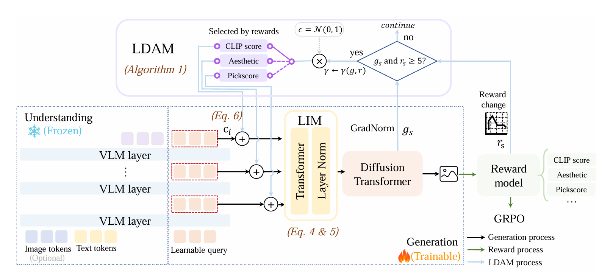
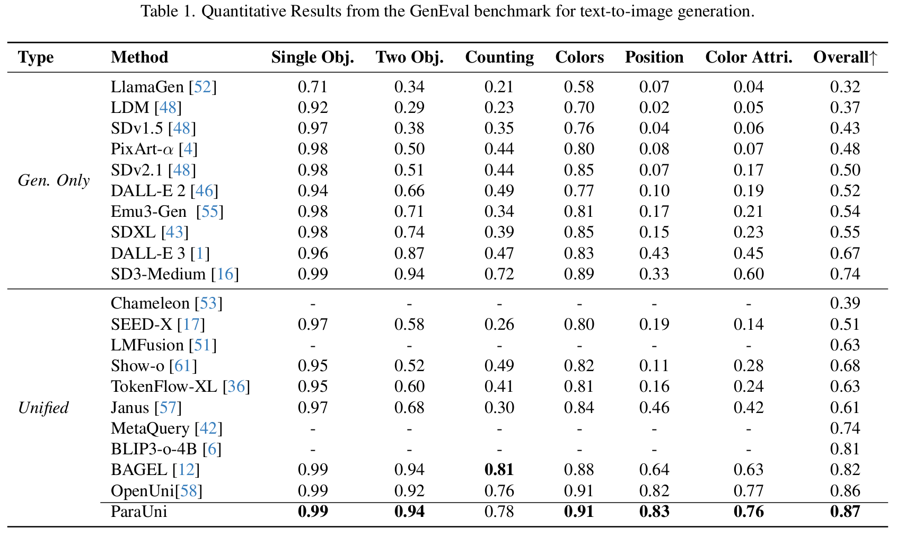

# ParaUni: Enhance Generation in Unified Multimodal Model with Reinforcement-driven Hierarchical Parallel Information Interaction

<div align="center">
    <a href="https://arxiv.org/abs/2512.05422">
        
    </a>
</div>

## Overview
We propose ParaUni. It extracts features from variants VLM's layers in a Parallel way for comprehensive information interaction and retains a flexible separation architecture to enhance generation in Unified multimodal model. Concretely, visual features from all VLM's layers are fed in parallel into a Layer Integration Module (LIM), which efficiently integrates fine-grained details and semantic abstractions and provides the fused representation as a condition to the diffusion model.


## Result


## Citation
Thanks to the developers of [OpenUni](https://arxiv.org/abs/2505.23661) for their excellent work. Our code is adapted from [OpenUni](https://github.com/wusize/OpenUni) and [Flow-GRPO](https://github.com/yifan123/flow_grpo).
If our work assists your research, feel free to give us a star ⭐ or cite us using:
```
@article{tan2025parauni,
  title={ParaUni: Enhance Generation in Unified Multimodal Model with Reinforcement-driven Hierarchical Parallel Information Interaction},
  author={Tan, Jiangtong and Liu, Lin and Huanng, Jie and Zhang, Xiaopeng and Tian, Qi and Zhao, Feng},
  journal={arXiv preprint arXiv:2512.05422},
  year={2025}
}
```
